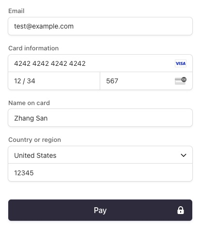

# Threadly

## Description

I started this project to further improve upon my skills in MongoDB, Express.js, React and Node.js. I also wanted to build a project that incorporated a payment system, such as stripe. So creating a ecommerce site was the perfect way to get that done.

## Table of Contents

- [Installation](#installation)
- [Usage](#usage)
- [Credits](#credits)
- [Challenges](#challenges)
- [Application](#application)

## Installation

- npm run i (in the root directory)
- npm run seed (in the root directory)
- npm run server (in the root directory)
- npm run dev (in the client directory)

## Usage

- Login or Sign Up.
- Search for products, even filter/sort products and select a product(of certain size),
- Add to cart, remove from cart if you no longer want it, see cart total and sub total on the cart page.
- Proceed to checkout, enter delivery information and proceed to payment.
- The Stripe checkout page also shows cart total, enter test card details:
  
- If the payment was successful you will be redirected to your orders page, showing all the items you have ordered.
- If the payment was not successful you will be redirected to the home page and the notification "Payment was cancelled" will be displayed.
- Logout when you want.

## Credits

I used a combination of 3 youtube tutorials as guidance for this project:

- To set up my server & database and deploy my application: https://www.youtube.com/watch?v=HwCqsOis894&t=4601s

- Styling, cart and search/filter functionality: https://www.youtube.com/watch?v=ZF73dpgRrWI&t=828s

- Stripe payment and order history functionality: https://www.youtube.com/watch?v=DBMPXJJfQEA&t=32296s

## Challenges

I had quite a few errors while building this project here are a few of them:

1. In the **Product page component**, when trying to display a single product on the page, i was met with the error like: "cannot read images[0] of undefined". I came to understand that the problem was the browser was mistakenly interpreting the images array from the single product document retriened from the database as a string of image URLs separated by commas due to JSX's automatic string conversion. 
So to overcome this issue I used Array.isArray(images) to return true only if images is actually an array.
When its confirmed that images is an array using Array.isArray(images), i was able to safely access images[0] knowing that it should return the first element of the array. Thus overriding the error.

2. In the **PlaceOrder page component**, i had an issue with the line_items (aka the list of products - name, size and price) were not being displayed on the checkout page. and the **placeOrder controller** where the stripe checkout session was being created i used console.log()checked to see if they were being passed in correctly from the PlaceOrder page component in the req.body from the axios request, and they were. I came to learn that the line_items did show on the stipe checkout page in an incognito browser, so i had not made a mistake in my code but rather my browser's cache needed to be cleared.

## Application

https://threadly-1kxd.onrender.com/
